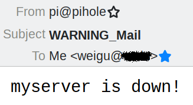

# Ping The Thing :)

## Check if all your devices are connected and send a mail if not

## Some infos here

I have an IP camera that looses sometimes the connection with my internal net. My NAS does not restart itself after a power loss. My MQTT server and other servers (e.g. openHAB) as well as some sensors are important  and must run to not loose data and to guarantee that all controls in the house are functioning.

If there is a problem with one of these devices I would like to know it as soon as possible. I'm more the e-mail type and not the GSM type :). So I need a warning mail if something is amiss.

Fortunately a simple Python script running on a Raspi (e.g. the pihole raspi) or other server can help.

We install a mail program and start the script at boot time. You have only to add your device list with the corresponding IP addresses to the script.

## All infos on: <http://www.weigu.lu/other_projects/python_coding/ping_the_thing/index.html>
